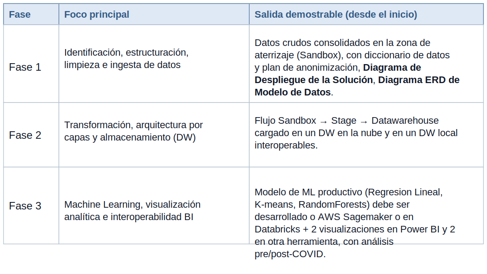

# Proyecto

## Plataforma Analítica de Mortalidad End-to-End

### Exploración de Datos del Estado de la Salud: Análisis de Mortalidad Pre-COVID y Post-COVID en Guatemala y Centroamérica / Fuentes de Datos (Públicas)

## Modalidad

Aprendizaje basado en proyectos bajo una consultoría modelo Naciones Unidas / PNUD. El encargo está orientado a resultados, no a herramientas: los Términos de Referencia definen qué debe lograrse; el equipo decide, propone y justifica el cómo.

Trabajo en equipo (firma consultora). Entrega oficial: UEDI. Defensa: oral. Estructura: tres (3) fases acumulativas.

La nube y las herramientas quedan a discreción del estudiante. En el presente enunciado no se le obliga al estudiante ni se le incita a utilizar herramientas de paga.

- Cantidad de equipo: 3 integrantes.
- Modalidad de calificación: oral y presentación.

## Contexto del Encargo

En el marco de una iniciativa de cooperación internacional para el fortalecimiento de los sistemas de información en salud, el Programa de las Naciones Unidas para el Desarrollo (PNUD), en acompañamiento al Ministerio de Salud Pública y Asistencia Social (MSPAS), busca comprender cómo cambiaron los patrones de mortalidad en el país entre el período pre-COVID (2015–2019) y el período post-COVID (2020 en adelante), con el fin de orientar decisiones de política pública y asignación de recursos.

El problema es, antes que de salud, de ingeniería de datos: la información de defunciones existe, pero está fragmentada en múltiples fuentes, formatos y niveles de calidad. El registro nacional transita del RENAP al INE, que codifica las causas de muerte bajo el estándar CIE-10 y publica estadísticas vitales; estos datos coexisten con registros institucionales, regionales e internacionales. La institución cliente no cuenta con una plataforma analítica integrada que permita consolidar, gobernar y explotar dichos datos para responder preguntas estratégicas.

Su equipo ha sido contratado como firma consultora para diseñar y construir una prueba de concepto (PoC) de una plataforma de datos de punta a punta (End-to-End) y entregar recomendaciones basadas en evidencia. Este es un caso ficticio con fines educativos.

Cláusula de cooperación internacional. A partir de un acuerdo institucional, el PNUD vincula a centros de investigación para el Sur Global en Europa; por lo tanto, la plataforma debe cumplir con el EU Data Act y con los principios de manejo ético de datos sensibles de salud (datos anonimizados y/o agregados).

## Objetivos

### Objetivo general

Diseñar, implementar y demostrar una plataforma de datos de punta a punta que integre fuentes heterogéneas de mortalidad, las gobierne bajo una arquitectura por capas hacia un repositorio analítico tipo Data Warehouse, y entregue evidencia comparativa pre-COVID / post-COVID que sustente recomendaciones de política para la institución cliente.

### Objetivos específicos

1. Diseñar e implementar procesos de ETL/ELT sobre fuentes de datos heterogéneas (locales y en la nube).
2. Construir una arquitectura por capas con tablas Sandbox, Stage y Fact-Dimensiones (modelado dimensional).
3. Consolidar la información en un repositorio analítico (Data Warehouse) tanto en la nube como en una instancia local, demostrando interoperabilidad entre ambos.
4. Aplicar Aprendizaje Automático (Machine Learning) a un problema real de mortalidad.
5. Producir visualización analítica en al menos dos (2) herramientas de BI distintas, demostrando interoperabilidad.
6. Garantizar el manejo ético, anonimizado y/o agregado de datos sensibles, en cumplimiento del EU Data Act.
7. Justificar técnicamente, ante el cliente, cada decisión de ingeniería adoptada.

## Competencias que el Equipo Debe Demostrar

- Diseño e implementación de procesos ETL/ELT.
- Modelado dimensional y construcción de repositorios tipo Data Warehouse.
- Manejo de bases de datos relacionales y no relacionales.
- Conocimiento práctico de formatos y protocolos de intercambio de información: JSON, XML, HTTP/HTTPS y servicios web/APIs (clave para la interoperabilidad entre herramientas de BI).
- Aprendizaje automático aplicado a un problema real.
- Visualización analítica en al menos dos herramientas de BI.
- Nociones deseables de gobernanza de datos, calidad y diccionarios de metadatos; sensibilidad para el manejo ético de datos sensibles (salud, mortalidad); interés en transformación digital del sector público y cooperación internacional.

## Estructura del Proyecto: Tres Fases Acumulativas

El proyecto se desarrolla y se evalúa en tres (3) fases. Cada fase constituye un hito de la consultoría, pero la naturaleza del trabajo es acumulativa y end-to-end: en la defensa de cada fase el equipo debe poder ejecutar el flujo completo desde el inicio (desde la fuente de datos) hasta el entregable correspondiente. No se evalúa el incremento de manera aislada; se evalúa que la tubería funcione de extremo a extremo en su estado actual.

### Resumen visual de fases

| Fase | Foco principal | Salida demostrable (desde el inicio) |
|---|---|---|
| Fase 1 | Identificación, estructuración, limpieza e ingesta de datos | Datos crudos consolidados en la zona de aterrizaje (Sandbox), con diccionario de datos y plan de anonimización, Diagrama de Despliegue de la Solución, Diagrama ERD de Modelo de Datos. |
| Fase 2 | Transformación, arquitectura por capas y almacenamiento (DW) | Flujo Sandbox → Stage → Datawarehouse cargado en un DW en la nube y en un DW local interoperables. |
| Fase 3 | Machine Learning, visualización analítica e interoperabilidad BI | Modelo de ML productivo (Regresion Lineal, K-means, RandomForests) debe ser desarrollado o AWS Sagemaker o en Databricks + 2 visualizaciones en Power BI y 2 en otra herramienta, con análisis pre/post-COVID. |

**Regla transversal: “cada fase desde el inicio”.** En toda defensa de fase, el equipo deberá demostrar el recorrido completo del dato: origen → ingesta → capas → repositorio → (según la fase) modelo y visualización. Una fase no se da por aprobada si la tubería previa dejó de funcionar.

## Fase 1 — Fundamentos de Datos: Identificación, Estructuración, Limpieza e Ingesta

### Identificación y obtención de fuentes de datos

El equipo debe localizar, gestionar y obtener datos de defunciones estructurados, con cobertura suficiente para comparar el período pre-COVID (2015–2019) con el período post-COVID (2020 en adelante). Las fuentes deben incluir Guatemala y, a nivel comparativo, al menos un referente de Centroamérica.

- RENAP — solicitud formal de información. El equipo redactará y gestionará una solicitud de información de registros de defunción ante el Registro Nacional de las Personas (RENAP), documentando el oficio y la respuesta como parte de la trazabilidad del dato.
- INE — estadísticas vitales. Defunciones con codificación de causas CIE-10 publicadas por el Instituto Nacional de Estadística.
- MSPAS y fuentes institucionales / regionales / internacionales. Registros que enriquezcan el análisis y permitan validar la calidad.
- Centroamérica. Al menos una fuente regional comparable (p. ej. institutos de estadística homólogos) para situar a Guatemala en contexto regional.

**Requisito de datos.** El conjunto de trabajo debe estar estructurado y centrado en defunciones (mortalidad), con dimensiones mínimas de tiempo (año/mes), geografía (departamento/municipio) y causa (CIE-10), suficientes para el análisis pre/post-COVID.

### Estructuración y limpieza

Desde la estructuración y limpieza de datos, el equipo consigue y prepara sus datos: normalización de esquemas, estandarización de códigos CIE-10, tratamiento de valores faltantes y atípicos, deduplicación, conciliación de catálogos geográficos y validación de integridad. Toda regla de limpieza debe quedar documentada.

### Ingesta desde fuentes heterogéneas

La ingesta debe demostrar el manejo de fuentes heterogéneas, combinando orígenes locales y en la nube. Como mínimo, el equipo deberá integrar datos provenientes de:

- Google Drive (archivos compartidos / exportaciones).
- SharePoint (repositorio documental institucional).
- Servicio de almacenamiento de objetos S3 (u Object Storage equivalente) en la nube de su elección.
- Base de datos relacional gestionada (RDS) como fuente — local o en la nube.
- Es posible utilizar webscrappers para obtener la información.

### Zona de aterrizaje: Tabla Sandbox (Base de datos sandbox)

Los datos ingeridos aterrizan, sin transformación destructiva, en la Tabla Sandbox: una zona de exploración fiel al origen que preserva la materia prima para auditoría y reproceso.

### Gobernanza inicial y ética

- Diccionario de datos y catálogo de metadatos preliminar.
- Plan de anonimización / agregación de datos sensibles (cumplimiento EU Data Act).
- Registro de procedencia (data lineage) desde la fuente hasta el Sandbox.

### Entregables

1. Modelo de Datos producido en DataModeler.
2. Arquitectura de Despliegue producida en Draw.io.
3. Pipelines de Ingesta de Datos versionadas en Github, se utilizará git blame para corroborar cambios.
4. Documentación desplegada con Github Actions (Mkdocs) en Github.

### Restricciones

1. No es posible utilizar Mermaid ni PlantUML para diagramados.
2. Durante la calificación se deberá tener cámara encendida y se deberá presentar toda la pantalla.
3. Se le realizará 1 pregunta a cada integrante sobre las arquitecturas; si no le es posible responder entonces existirá una penalización de 20 puntos al equipo.
4. La entrega de esta fase es requisito para la entrega de la siguiente fase.
5. No es posible mover los horarios de calificación una vez se hayan establecido.
6. Se debe utilizar la siguiente fuente de datos (una de las múltiples fuentes, el estudiante es libre de utilizar más fuentes de datos no referentes a esta misma):
   - https://datos.ine.gob.gt/dataset/estadisticas-vitales-defunciones
   - Se sugiere también la línea base de OMS: https://platform.who.int/mortality/countries/country-details/MDB/guatemala
   - El estudiante deberá proponer más fuentes de datos para la ingesta y realizar un catálogo de fuentes de datos.

Fecha de entrega: 12 de junio a las 23:59.

## Fase 2 — Transformación, Arquitectura por Capas y Almacenamiento (Data Warehouse)

### Proceso de transformación y almacenamiento por capas

El equipo construye el proceso de transformación y almacenamiento sobre una arquitectura por capas. Cada capa cumple un propósito y se materializa en tablas explícitas:

| Capa / Tabla | Propósito |
|---|---|
| Tabla Sandbox | Aterrizaje fiel al origen (proveniente de la Fase 1). Materia prima, sin transformación destructiva. |
| Tabla Stage | Datos conformados, limpios, tipados y estandarizados; aplicación de reglas de negocio y de calidad. |
| Tabla Fact-Dimensiones | Modelo dimensional (esquema estrella): tabla(s) de hechos de defunciones y sus dimensiones (tiempo, geografía, causa CIE-10, sexo, grupo etario). |

### Orquestación de la transformación

- AWS Glue (Jobs). Se requiere implementar al menos un proceso de transformación mediante Jobs de AWS Glue, como parte del pipeline ETL/ELT.
- Interoperabilidad. El intercambio entre componentes debe apoyarse en formatos y protocolos estándar (JSON, XML, HTTP/HTTPS, APIs / servicios web).

### Repositorio analítico (Data Warehouse target)

El flujo debe culminar en una base de datos target final, de tipo repositorio Data Warehouse. Se exige una arquitectura híbrida que demuestre interoperabilidad nube–local:

- DW en la nube. Repositorio analítico en la nube de su elección (cualquier nube).
- Data Warehouse local. El proyecto debe incluir un Data Warehouse local, y el pipeline debe ir a traer la parte correspondiente al DW local (federación / extracción cruzada), demostrando que ambos repositorios interoperan.

**Criterio de aceptación — Fase 2.** Debe demostrarse, en ejecución y desde el inicio, el recorrido Sandbox → Stage → Fact-Dimensiones, con carga efectiva tanto en el DW en la nube como en el DW local, y evidencia de que el sistema va a traer datos del DW local.

## Fase 3 — Machine Learning, Visualización Analítica e Interoperabilidad BI

### Aprendizaje Automático (Machine Learning)

Sobre los datos consolidados en el repositorio analítico, el equipo aplica Machine Learning a un problema real de mortalidad (por ejemplo: estimación de exceso de mortalidad, pronóstico de defunciones por causa, segmentación de patrones por geografía/causa, o detección de cambios estructurales pre/post-COVID). La definición precisa del problema de ML queda a propuesta del equipo (pendiente de definición y justificación).

- Amazon SageMaker. Plataforma para el entrenamiento y/o despliegue del modelo de Machine Learning.
- Databricks. Se incorpora únicamente como herramienta para procesar una parte del flujo de Machine Learning sobre los datos (no como repositorio ni como núcleo del pipeline).

### Visualización analítica e interoperabilidad BI

El equipo debe entregar visualizaciones en al menos dos herramientas de BI distintas, demostrando interoperabilidad. La distribución mínima exigida es:

- Dos (2) visualizaciones en Power BI, empleando Power Query para la preparación de datos y DAX para las medidas/cálculos.
- Dos (2) visualizaciones en otra herramienta a elección (p. ej. Tableau u otra). Para Tableau se debe gestionar la licencia académica / carnet estudiantil correspondiente.
- Interoperabilidad. Al menos una vista o tablero debe ser compuesto, integrando salidas de Power BI con la segunda herramienta, evidenciando que ambas operan sobre el mismo repositorio analítico de manera interoperable.

### Análisis y recomendaciones

- Análisis comparativo de defunciones Pre-COVID (2015–2019) vs. Post-COVID (2020 en adelante).
- Hallazgos sustentados en evidencia (estructurados por causa, geografía y tiempo).
- Recomendaciones de política y asignación de recursos para la institución cliente, derivadas del análisis.

## Arquitectura de Referencia (resumen del flujo)

El siguiente flujo resume la solución end-to-end que se construye de manera acumulativa a lo largo de las tres fases:

| Etapa | Componentes esperados |
|---|---|
| Fuentes | RENAP (solicitud), INE (CIE-10), MSPAS, fuentes regionales de Centroamérica. Orígenes locales y en la nube. |
| Ingesta | Google Drive, SharePoint, S3/OBS, RDS. Formatos JSON/XML; protocolos HTTP/HTTPS y APIs. |
| Capas | Sandbox → Stage → Fact-Dimensiones (modelo dimensional). Orquestación con AWS Glue (Jobs). |
| Almacenamiento | DW en la nube + DW local interoperables (el pipeline va a traer datos del DW local). |
| ML | Amazon SageMaker (núcleo) + Databricks (procesa una parte del ML). |
| BI / Salida | 2 visualizaciones en Power BI (Power Query + DAX) + 2 en otra herramienta (p. ej. Tableau). Vista compuesta interoperable. |

## Tarea Complementaria: Integraciones con Databricks

Como tarea de apoyo al proyecto (preparatoria de la Fase 3), cada equipo debe investigar y documentar las integraciones de Databricks que habiliten el procesamiento de una parte del flujo de Machine Learning sobre los datos del repositorio analítico.

1. Conectividad de datos. Mecanismos para que Databricks se conecte y consuma los datos del DW / almacenamiento de objetos (S3/OBS) y, de ser aplicable, del RDS.
2. Integración con la nube. Cómo se integra Databricks con los servicios de la nube elegida y con el flujo de ML (incluyendo su relación con Amazon SageMaker).
3. Interoperabilidad. Formatos y protocolos de intercambio (JSON/XML/APIs) empleados en la integración.
4. Prueba de concepto. Evidencia de que Databricks procesa, de extremo a extremo, al menos una porción del pipeline de ML con datos reales del proyecto.

Entrega de la tarea: documento breve (Markdown) con el diseño de integración y evidencia de la prueba de concepto. Se entrega por UEDI antes de la defensa de la Fase 3.

## Entregables por Fase

### Entregables — Fase 1

1. Inventario y procedencia de fuentes (incluyendo el oficio de solicitud a RENAP y su evidencia).
2. Scripts/procesos de ingesta desde Google Drive, SharePoint, S3/OBS y RDS.
3. Tabla Sandbox poblada y diccionario de datos / metadatos preliminar.
4. Plan de limpieza y plan de anonimización (EU Data Act).

### Entregables — Fase 2

1. Pipeline ETL/ELT con Jobs de AWS Glue.
2. Tablas Stage y Fact-Dimensiones (modelo dimensional documentado).
3. DW en la nube y DW local cargados e interoperables, con evidencia de la extracción cruzada del DW local.
4. Documento de decisiones técnicas justificadas.

### Entregables — Fase 3

1. Modelo de ML en Amazon SageMaker + componente de procesamiento en Databricks.
2. Dos visualizaciones en Power BI (Power Query + DAX) y dos en otra herramienta (p. ej. Tableau), con al menos una vista compuesta interoperable.
3. Análisis comparativo Pre-COVID / Post-COVID y recomendaciones de política basadas en evidencia.
4. Documentación final e informe de consultoría incluyendo presupuesto de personal y el precio de la consultoría.
5. Project Charter del Proyecto General: Diagrama de Gantt, Work Breakdown Structure (Work Packages), Fechas de Entrega en un plazo de 4 meses.

## Observaciones

1. El proyecto se trabaja en equipo, bajo el rol de firma consultora.
2. El encargo está orientado a resultados, no a herramientas: toda decisión técnica (ingesta, transformación, almacenamiento, ML y BI) es parte de la propuesta del equipo y se evalúa como tal.
3. Se permite el uso de cualquier nube, siempre que se cumplan los requisitos del enunciado.
4. El manejo de datos de mortalidad debe ser ético y anonimizado/agregado (cláusula de protección de datos del encargo y EU Data Act).
5. Cada fase debe poder demostrarse desde el inicio (flujo end-to-end vigente).
6. La documentación debe ser desplegada con MkDocs utilizando GitHub Actions.
7. Todos los estudiantes deberán poder demostrar con git blame y git diff sus cambios.

## Forma de Entrega

- Entrega oficial: plataforma UEDI, en el apartado correspondiente a cada fase, antes de la fecha y hora indicadas.
- Defensa: oral, donde el equipo ejecuta y sustenta el flujo de extremo a extremo correspondiente a la fase. Durante la calificación se solicitarán cambios.
- Código y artefactos: repositorio del curso, respetando la estructura de carpetas y sin modificar el trabajo de otros equipos.
- Arquitectura de Despliegue: el equipo debe entregar 4 vistas en un archivo de Draw.io con 4 pestañas a 4 modelos basados en ello. No es posible utilizar PlantUML ni Mermaid. Durante la calificación se solicitarán explicaciones de componentes.

## Evaluación

| Fase | Criterios principales | Fecha |
|---|---|---|
| Fase 1 | Fuentes, ingesta heterogénea, Sandbox, limpieza, ética/anonimización. | 12 de Junio |
| Fase 2 | Capas Stage/Fact-Dim, AWS Glue, DW nube + DW local interoperables. | 19 de Junio |
| Fase 3 | ML (SageMaker + Databricks), 2 + 2 visualizaciones BI, análisis pre/post-COVID. | 26 de Junio y 30 de Junio |
| Presentación | Presentación. | 26 de Junio y 30 de Junio |
| Tarea | Integraciones con Databricks (prueba de concepto). | 17 de Junio |

## Listado de Servicios bajo Free Tiers
